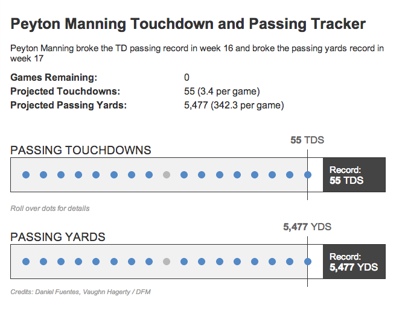

peyton-manning-record and peyton-manning-graph
==============================================

What is this?
-------------

App to show Peyton Manning's progress during the 2013-2014 season toward various records and a collection of graphs detailing his accomplishments after the fact.

Live demo: http://www.denverpost.com/broncos/ci_24589355/how-many-touchdowns-has-peyton-manning-thrown-2013

Credits
---------

Vaughn Hagerty, Nelson Hsu, Daniel Fuentes

Assumptions
-----------

* Google visualization API
* jQuery and jQuery UI
* handlebars.js

What's in here?
---------------

The project contains the following folders and important files:

* ``index.html`` -- The Peyton Manning record app html
* ``lib/js`` -- Javascript
* ``lib/css`` -- Strangely enough, stylesheets
* ``peyton-graph/index.html`` -- The Peyton Manning graph app html
* ``peyton-graph/lib/js`` -- Javascript
* ``peyton-graph/lib/css`` -- Strangely enough, stylesheets
* ``peyton-graph/lib/img`` -- images -- shocking, I know

License
----------

This code is available under the MIT license. For more information, please see the LICENSE file in this repo.

